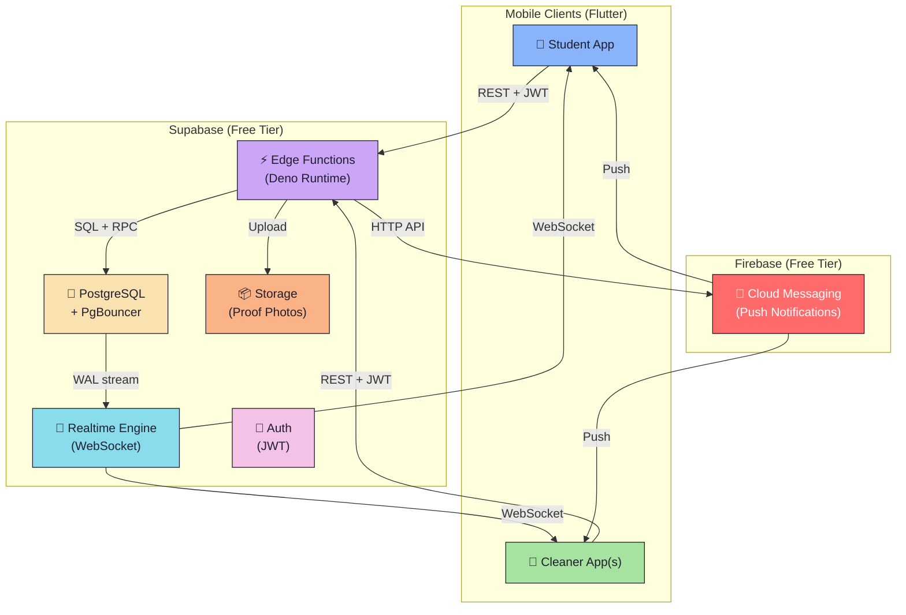
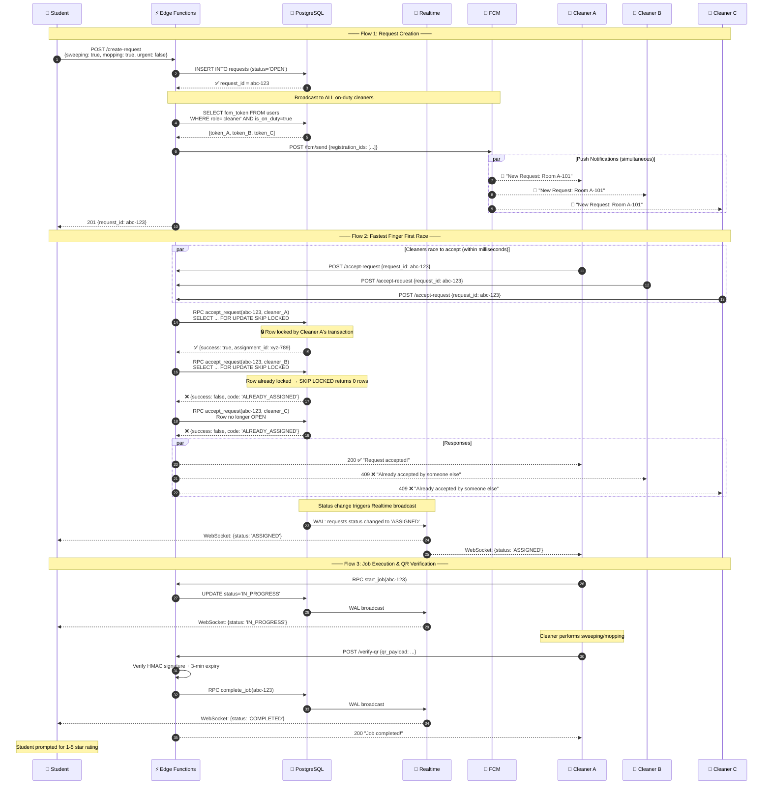
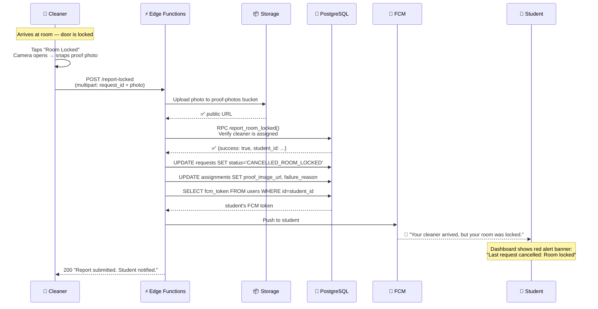

# CleanIT — System Architecture

## Overview

CleanIT uses a **serverless-first** architecture powered by **Supabase** (PostgreSQL + Edge Functions + Realtime) and **Firebase Cloud Messaging (FCM)** for push notifications. This eliminates server management costs and scales effortlessly to 1000+ concurrent users on free tiers.

---

## Architecture Diagram

---

## End-to-End Sequence: Request → Broadcast → Race → Completion

---

## Sequence: Room Locked Exception Path

---

## How It All Works Together

### 1. FCM Broadcast to 100+ Cleaners

When a student creates a request, the `create-request` Edge Function queries all on-duty cleaners' FCM tokens and sends a **multicast push notification** in a single HTTP call (batched in groups of 500). FCM handles the fan-out internally — it's designed for millions of messages and is **100% free**.

**Urgent requests** use a distinct Android notification channel (`urgent_requests`) mapped to a siren sound file, so the cleaner's phone plays an alarm instead of a default ding.

### 2. Race-Condition Resolution at the Database Level

This is the most critical piece. When 100 cleaners tap "Accept" simultaneously:

| Step | What Happens |
|------|-------------|
| 1 | Each cleaner's request hits a separate Edge Function instance |
| 2 | Each instance calls `accept_request()` — a PostgreSQL function |
| 3 | PostgreSQL's `SELECT ... FOR UPDATE SKIP LOCKED` grabs an **exclusive row lock** |
| 4 | The **first** transaction to acquire the lock wins and proceeds |
| 5 | All other transactions see zero rows (thanks to `SKIP LOCKED`) and return immediately with "already taken" |
| 6 | The winner's transaction atomically updates the status and creates the assignment |

This is **non-blocking** — losers don't wait for the winner's transaction to commit. They get an instant rejection. No deadlocks, no retries, no application-level distributed locks needed.

### 3. Real-Time "Loser" Notification via Supabase Realtime

Supabase Realtime listens to PostgreSQL's **Write-Ahead Log (WAL)** stream. When `requests.status` changes from `OPEN` to `ASSIGNED`:

1. The WAL event is captured by Supabase's Realtime engine
2. It broadcasts to all clients subscribed to that row's channel
3. Every cleaner's Flutter app receives the WebSocket message in ~50ms
4. The app UI auto-updates: the pop-up dismisses with "Already accepted by someone else"

This is **dual-channel redundancy**: the HTTP response from the Edge Function tells the individual loser instantly, while the WebSocket broadcast updates everyone's UI simultaneously.

### 4. "Room Locked" Push Back to Student

The flow is: **Cleaner → Edge Function → Storage (photo) → Database (status update) → FCM → Student**.

The Edge Function orchestrates all of this in a single request:
1. Validates the cleaner is the assigned cleaner (prevents abuse)
2. Uploads the mandatory proof photo (prevents false reports)
3. Updates both `requests` and `assignments` tables atomically
4. Fetches the student's FCM token and pushes a notification

The student's app also receives the status change via Supabase Realtime WebSocket, so even if FCM push is delayed, the UI updates instantly.

---

## Free Tier Capacity

| Service | Free Tier Limit | CleanIT Usage |
|---------|----------------|---------------|
| Supabase Database | 500 MB, unlimited API calls | ~50 KB/1000 requests |
| Supabase Edge Functions | 500K invocations/month | ~10K/month at 1000 students |
| Supabase Realtime | 200 concurrent connections | ✅ Handles 200 concurrent |
| Supabase Storage | 1 GB | Proof photos (~100 KB each) |
| Supabase Auth | 50,000 MAU | ✅ |
| Firebase FCM | Unlimited | ✅ 100% free forever |

> **Scaling note**: If you exceed 200 concurrent Realtime connections, upgrade to Supabase Pro ($25/month) for 10,000 concurrent connections. All other tiers remain free.
